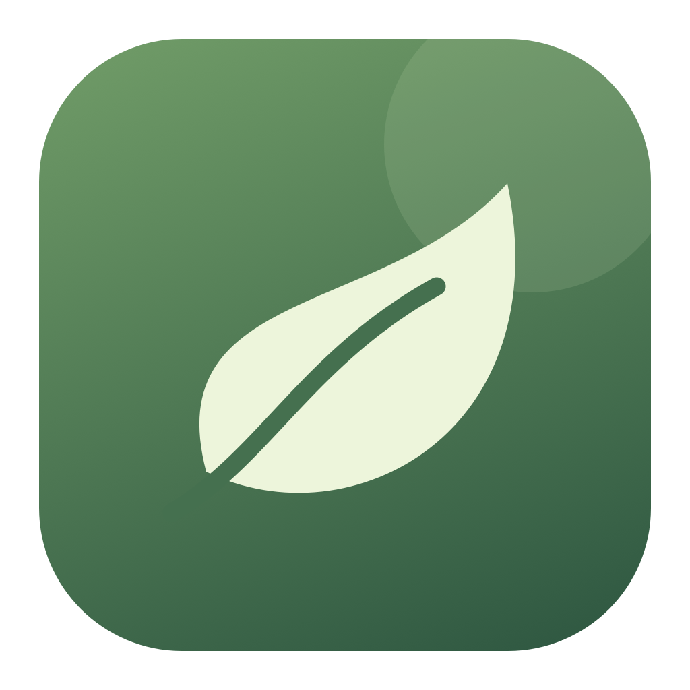

# OpenAway

A native, open-source break reminder for macOS. Rest your eyes and reset
your posture without interupting your workflow.

Built with SwiftUI and AppKit. No accounts, analytics, or external dependencies.

## Install

Requires **macOS 13 or later**.

Download **OpenAway-macos.dmg** from [the latest release](https://github.com/phucisstupid/openaway/releases/latest).

The universal ZIP is also available; extract it and move **OpenAway.app** to
**Applications**. The DMG and universal ZIP support both Apple Silicon and Intel Macs.

Or install with Homebrew:

```sh
brew tap phucisstupid/openaway
brew install --cask phucisstupid/openaway/openaway
```

Release builds are ad-hoc signed, not Developer ID signed or notarized. macOS may
block the first launch; use **System Settings >
Privacy & Security > Open Anyway**.

## Features

- Customizable eye breaks, blink and posture reminders.
- Automatic pauses for idle time, meetings, video playback, and selected apps.
- Native settings, menu bar controls, and local activity history.

Preferences and history stay on your Mac. OpenAway does not capture screen,
keyboard, camera, or microphone content.

## Development

Use Xcode or Apple's Command Line Tools on macOS:

```sh
./scripts/build-app.sh
open dist/OpenAway.app
swift test
```

With Command Line Tools only, use `./scripts/test-core.sh` instead of `swift test`.
Xcode 26 or matching Command Line Tools enables Liquid Glass on macOS 26+;
older systems use native materials.

See [Contributing](CONTRIBUTING.md) for verification and
[Architecture](docs/ARCHITECTURE.md) for the implementation structure.
Repository guidance lives in [AGENT.md](AGENT.md).

## License

[MIT](LICENSE). OpenAway is an independent project, not affiliated with LookAway.
